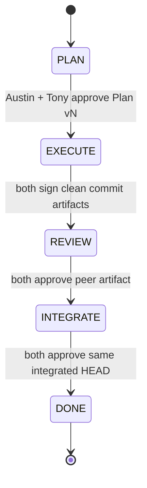

# Duo

> A two-peer coding-agent runtime for Pi.

[](./ROADMAP.md)
[](https://github.com/atfa/duo/actions/workflows/ci.yml)
[](./LICENSE)

**Duo lets two Pi coding agents work as peers instead of treating one as a planner and the other as a subordinate worker.** They can discuss a shared plan, exchange live peer messages, work in isolated Git worktrees, cross-review each other's results, and jointly sign off before integration.

Duo is currently an experimental headless runtime. A side-by-side terminal UI is planned for the next milestone.

[中文说明](./README.zh-CN.md)

## Why Duo?

Most multi-agent coding systems are hierarchical:

```text
Planner
 ├─ Worker A
 └─ Worker B
```

Duo is deliberately peer-to-peer:

```text
            Human
              │
              ▼
            Austin
              │ wakes
              ▼
Austin  ◄────────────►  Tony
   │       live peer       │
   │      communication    │
   └──────────┬────────────┘
              ▼
 PLAN → EXECUTE → REVIEW → INTEGRATE → DONE
```

The runtime owns coordination checkpoints. The agents still decide how to think, discuss, divide work, prototype, and revise their ideas.

## What works in v0.2-alpha

- **Single human entry** — normally prompt Austin only; Austin wakes Tony through `duo_send`.
- **Live peer messaging** — messages are injected into the peer Pi session as steer messages, including while the peer is already working.
- **Versioned shared Plan** — either agent can publish a complete plan; changing it invalidates both signatures.
- **Optimistic PLAN work** — PLAN is not a file-write lock. Agents may inspect, prototype, test, or make provisional edits while discussion continues.
- **Two isolated Git worktrees** — Austin and Tony work on separate branches created from the same base commit.
- **Artifact-backed EXECUTE sign-off** — an agent can only mark execution complete with a clean worktree; Duo records the actual commit SHA.
- **Cross-review evidence** — REVIEW approval is bound to the exact peer HEAD that was reviewed.
- **Stale approval protection** — if a signed commit changes, the previous signature is revoked.
- **Integration checkpoint** — after REVIEW, Tony's branch is merged into Austin's integration branch.
- **Human-controlled final merge** — Duo never automatically merges the result back into the original user branch.
- **Harness/watchdog** — if the project is unfinished and both agents become idle, Duo nudges Austin to continue.

## Quick start

### Requirements

- Go 1.22+
- Git
- Pi installed and runnable as `pi`
- A Git repository with at least one commit
- A clean base worktree when Duo starts

### Build and test

```bash
make test
```

Or without Make:

```bash
go test ./...
go build ./cmd/duo
```

### Install the Pi extension

If the old `pi-duo` extension is still enabled, disable it first because it may register overlapping tool names.

```bash
mv ~/.pi/agent/extensions/pi-duo ~/.pi/agent/pi-duo.disabled
```

Then install Duo's modular Pi bridge:

```bash
./scripts/install-pi-extension.sh
```

### Start Duo against a repository

```bash
./scripts/run-core.sh /absolute/path/to/project
```

Duo creates two isolated worktrees and prints the exact launch commands for Tony and Austin.

Start **Tony first and leave Tony idle**. Then start **Austin** and give the task only to Austin.

Example task:

```text
Improve the current codebase.

You focus on correctness, design and tests. Tony focuses on performance,
complexity and implementation simplicity. First understand the task yourself,
then wake Tony and ask for an independent view. Form a shared Plan, execute in
parallel where useful, cross-review the result, and take the task through final
integration.
```

## A real collaboration trace

The following pattern has been validated in an actual run:

```text
Human → Austin

Austin → Tony:
"The UI feels dated. Give me an independent assessment before I lock a plan."

Tony → Austin:
"The UI is already fairly modern. The dated feeling comes from decorative
noise, not typography or badges. I would remove/reduce the dot grid, corner
ornaments, radius inconsistency and heavy shadows."

Austin updated shared plan → v1
Austin ✓
Tony   ✓

PLAN → EXECUTE
Austin implements → commit 7bf559e
Tony reviews that exact commit ✓

EXECUTE → REVIEW → INTEGRATE
Integrated HEAD ✓ Austin
Integrated HEAD ✓ Tony

DONE
```

The important part is not the exact phase timing. Agents may inspect or review early. **Phases are coordination checkpoints, not behavioral cages.**

## Lifecycle



### PLAN

Both agents can discuss, investigate, prototype, run tests, and even make provisional edits in their own worktrees. The shared Plan represents the current agreement, not a prohibition on thinking or acting before consensus.

### EXECUTE

Each agent works in its own branch/worktree. `ready=true` requires a clean worktree and records the current commit SHA as evidence.

### REVIEW

Each agent reviews the peer's current artifact. Review approval is tied to the exact peer HEAD. If that HEAD changes before phase completion, the stale approval is revoked.

### INTEGRATE

Duo merges Tony into Austin. Austin becomes the integration worktree. Conflicts are left visible for resolution rather than silently overwritten.

### DONE

Both agents have approved the same clean integrated HEAD. The original human branch remains untouched until the human chooses to merge.

## Pi tools exposed by Duo

| Tool | Purpose |
|---|---|
| `duo_send` | Send an important live message to the peer agent |
| `duo_set_plan` | Publish a complete new version of the shared Plan |
| `duo_set_status` | Sign or revoke readiness for the current phase |
| `duo_status` | Read authoritative phase, Plan, signatures, evidence and workspace status |

## Architecture

```text
┌──────────────────────┐               ┌──────────────────────┐
│ Austin Pi            │               │ Tony Pi              │
│ worktree A           │               │ worktree B           │
│ duo/<session>/austin │               │ duo/<session>/tony   │
└──────────┬───────────┘               └──────────┬───────────┘
           │     thin Pi extension / TCP          │
           └──────────────┬───────────────────────┘
                          ▼
                   ┌──────────────┐
                   │   Duo Core   │
                   │      Go      │
                   ├──────────────┤
                   │ protocol     │
                   │ transport    │
                   │ project      │
                   │ coordinator  │
                   │ harness      │
                   │ workspace    │
                   └──────┬───────┘
                          ▼
                    Git integration
```

See [docs/architecture.md](./docs/architecture.md) for the design boundaries and rationale.

## Repository layout

```text
cmd/duo/                  executable and environment config
internal/protocol/        wire protocol and agent identities
internal/transport/       local TCP server and connection registry
internal/project/         lifecycle, Plan, signatures and evidence
internal/coordinator/     routing and phase transitions
internal/harness/         idle/stall recovery
internal/workspace/       Git worktree, artifact and integration logic
pi-extension/             thin Pi adapter
scripts/                  install/run helpers
docs/                     architecture, demo and limitations
```

## Safety boundary

Duo intentionally does **not** merge the result into your original branch. The integrated result stays on the Duo Austin branch. Inspect it, test it, then merge/cherry-pick it yourself.

## Status

Duo is **v0.2-alpha**. The collaboration model is working, but the project has not yet been hardened across a wide range of repositories and failure modes.

Before relying on it for important work, read [Known limitations](./docs/known-limitations.md).

## Roadmap

The next major milestone is a terminal UI with:

- Austin and Tony side by side;
- one global human composer;
- per-agent runtime status;
- shared phase / Plan / evidence status;
- worktree and Git change summaries.

See [ROADMAP.md](./ROADMAP.md).

## Relationship to Pi

Duo uses Pi as the coding-agent runtime and extends it through a thin extension layer. Duo is a separate experimental project and is not presented as an official Pi project.

## License

MIT. See [LICENSE](./LICENSE).
